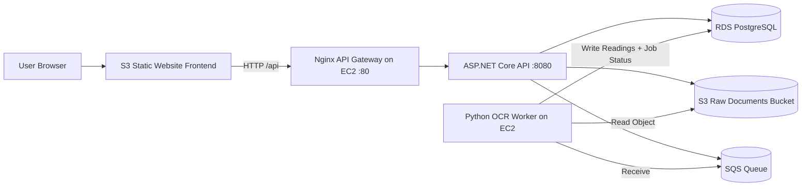

# AI Health Platform

AI Health Platform is a document-driven health analytics system that ingests lab/genomics/wearable files, processes them asynchronously, extracts normalized biomarkers, and produces user-level and document-level insights.

This repository contains:

- .NET 8 API (`src/Api`)
- Python OCR worker (`src/OcrWorker`)
- Angular frontend (`frontend`)
- Deployment and operations docs (`docs`)

## Architecture

### Production (current AWS deployment)



### Core processing flow

1. User authenticates (`/api/auth/login`, `/api/auth/register`).
2. User uploads document (direct upload or presigned + finalize path).
3. API stores metadata and enqueues an SQS message.
4. OCR worker consumes queue, parses/normalizes biomarkers, writes to DB.
5. API serves upload status, history, and generated insights.

## Repository Structure

```text
AiHealthPlatform/
├── README.md
├── docker-compose.yml
├── docker-compose.aws.yml
├── deploy/
│   └── nginx/
│       └── api-gateway.conf
├── docs/
│   ├── PROJECT_DOCUMENTATION.md
│   ├── AWS_FREE_TIER_DEPLOYMENT.md
│   └── PROBLEMS_AND_RESOLUTIONS.md
├── frontend/
│   ├── angular.json
│   ├── src/
│   └── README.md
└── src/
    ├── Api/
    └── OcrWorker/
```

## Documentation Map

Use these docs depending on what you need:

- `docs/PROJECT_DOCUMENTATION.md`: System architecture, domain model, API behavior.
- `docs/AWS_FREE_TIER_DEPLOYMENT.md`: AWS provisioning, deployment, troubleshooting runbook.
- `docs/PROBLEMS_AND_RESOLUTIONS.md`: Incident history and applied fixes.

## Key API Endpoints

Auth and profile:

- `POST /api/auth/register`
- `POST /api/auth/login`
- `GET /api/me`

Uploads and processing:

- `POST /api/uploads/direct`
- `POST /api/uploads/presign`
- `POST /api/uploads/finalize`
- `GET /api/uploads/status/{docId}`
- `POST /api/uploads/reprocess/{docId}`

Insights and review:

- `POST /api/insights/generate/{docId}`
- `GET /api/insights/{docId}`
- `POST /api/insights/generate`
- `GET /api/insights/latest`
- `POST /api/insights/recommendations/{recommendationId}/request-review`
- `POST /api/insights/recommendations/{recommendationId}/approve`

Operational:

- `GET /health`
- `GET /swagger/index.html`

## Quick Start (local development)

### Prerequisites

- .NET SDK 8+
- Python 3.11+
- Node.js 20+
- Docker + Docker Compose
- AWS resources (S3 + SQS) and credentials

### Start backend services

From repository root:

```bash
docker compose up -d --build
```

Check logs:

```bash
docker compose logs -f api
docker compose logs -f ocr-worker
```

### Start frontend (dev)

```bash
cd frontend
npm ci
npm start
```

Frontend dev server runs on `http://localhost:4200` and proxies `/api` calls.

## AWS Deployment (free-tier oriented)

Current deployment pattern:

- EC2 (`t3.micro`) hosts `api`, `ocr-worker`, and `api-gateway` containers.
- RDS PostgreSQL (`db.t3.micro`) stores app data.
- S3 hosts frontend static assets and raw uploaded docs.
- SQS drives asynchronous OCR processing.

Use this runbook for exact steps and commands:

- `docs/AWS_FREE_TIER_DEPLOYMENT.md`

## Configuration

Important environment variables:

- DB: `CONNSTR_RDS` or `ConnectionStrings__Default`
- Auth: `JWT_KEY`, `JWT_ISSUER`, `JWT_AUDIENCE`
- AWS: `AWS_REGION`, `S3_BUCKET`, `SQS_QUEUE_URL`
- CORS: `CORS_ALLOWED_ORIGINS`
- LLM: `LLM_BASE_URL`, `LLM_API_KEY`, `LLM_MODEL`, `LLM_TIMEOUT_SECONDS`

For AWS deploy template values, see:

- `.env.aws.example`

## Health and Verification

API health checks:

```bash
curl http://<ec2-host>/health
curl http://<ec2-host>/swagger/index.html
```

Common runtime checks:

- API container up and listening through gateway.
- Worker actively polling SQS.
- RDS reachable from EC2 security group.
- CORS preflight includes `Access-Control-Allow-Origin` for frontend origin.

## Security Notes

- Keep EC2 SSH (`22`) restricted to your IP.
- Restrict HTTP (`80`) to your IP during testing; open intentionally for public access.
- Prefer EC2 IAM role over long-lived AWS keys.
- Do not commit secrets (`.env`, `.env.aws`) to git.

## Troubleshooting

If you see `502 Bad Gateway`, check API first:

```bash
docker compose --env-file .env.aws -f docker-compose.aws.yml logs --tail=200 api
```

If browser calls fail with CORS errors, verify preflight and `CORS_ALLOWED_ORIGINS`:

```bash
curl -i -X OPTIONS 'http://<api-host>/api/auth/register' \
  -H 'Origin: http://<frontend-endpoint>' \
  -H 'Access-Control-Request-Method: POST' \
  -H 'Access-Control-Request-Headers: content-type,authorization'
```

For known issues and resolutions, see:

- `docs/PROBLEMS_AND_RESOLUTIONS.md`
