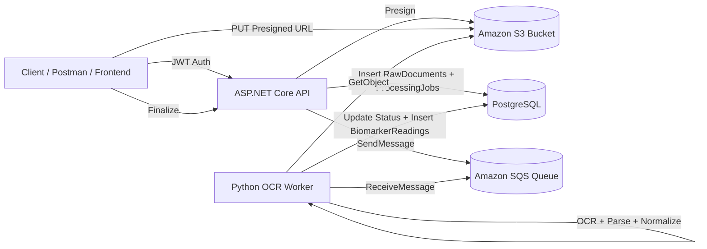

# AI Health Platform - Project Documentation

## 1) Project Overview

AI Health Platform is a two-service backend system that ingests health documents, stores source files in S3, queues processing through SQS, and extracts normalized biomarker readings into PostgreSQL.

Primary goals:
- Secure upload flow using pre-signed S3 URLs
- Asynchronous processing via queue/worker pattern
- Structured persistence for documents, jobs, and extracted biomarker data
- Idempotency on finalize to avoid duplicate records for same object key

---

## 2) High-Level Architecture



---

## 3) Runtime Components

### 3.1 API Service (ASP.NET Core, .NET 8)
Path: `src/Api`

Responsibilities:
- Authentication and JWT issuance
- Upload orchestration (`presign`, `finalize`, `reprocess`)
- Persisting document and job metadata
- Publishing queue messages for async processing

Key files:
- `src/Api/Program.cs`
- `src/Api/Controllers/AuthControllers.cs`
- `src/Api/Controllers/UploadControlller.cs`
- `src/Api/Auth/AppDbContext.cs`
- `src/Api/Domain/*.cs`

### 3.2 OCR Worker Service (Python)
Path: `src/OcrWorker`

Responsibilities:
- Poll SQS and process newest message
- Load source file from S3
- OCR + parse measurements
- Normalize units and canonical biomarker codes
- Persist readings and update job/document status

Key files:
- `src/OcrWorker/main.py`
- `src/OcrWorker/app/worker.py`
- `src/OcrWorker/app/ocr_parser.py`
- `src/OcrWorker/app/normalization.py`
- `src/OcrWorker/app/config.py`

### 3.3 Data Store
PostgreSQL with EF Core migrations.

Core tables:
- `RawDocuments`
- `ProcessingJobs`
- `BiomarkerReadings`
- Identity tables (`AspNetUsers`, `AspNetRoles`, etc.)

---

## 4) Project Structure

```text
AiHealthPlatform/
├── .env
├── Api.sln
├── docker-compose.yml
├── docs/
│   ├── PROJECT_DOCUMENTATION.md
│   └── PROBLEMS_AND_RESOLUTIONS.md
└── src/
    ├── Api/
    │   ├── Program.cs
    │   ├── Controllers/
    │   │   ├── AuthControllers.cs
    │   │   ├── MeController.cs
    │   │   └── UploadControlller.cs
    │   ├── Auth/
    │   ├── Domain/
    │   └── Migrations/
    └── OcrWorker/
        ├── Dockerfile
        ├── requirements.txt
        ├── README.md
        └── app/
            ├── config.py
            ├── normalization.py
            ├── ocr_parser.py
            └── worker.py
```

---

## 5) End-to-End Processing Flow

### Step 1: Authenticate
- `POST /api/auth/login`
- Returns JWT token for protected endpoints

### Step 2: Request Presigned URL
- `POST /api/uploads/presign`
- Body includes `fileName`, `contentType`, `docType`
- Returns `uploadUrl`, `bucket`, `objectKey`

### Step 3: Upload Document to S3
- `PUT <uploadUrl>`
- Must send matching `Content-Type`
- No Bearer token on this S3 PUT call

### Step 4: Finalize Upload
- `POST /api/uploads/finalize`
- Creates `RawDocument` + `ProcessingJob`
- Publishes message to SQS

### Step 5: Worker Processing
- Worker receives SQS message
- Downloads S3 object
- Extracts text from PDF/image (native PDF text first, OCR fallback)
- Parses measurements and normalizes units
- Inserts `BiomarkerReadings`
- Marks job/document as succeeded and deletes SQS message

### Step 6: Reprocess Existing Document (No Re-upload)
- `POST /api/uploads/reprocess/{docId}`
- Enqueues a fresh processing job for existing `RawDocument`

Swagger-friendly variant:
- `POST /api/uploads/reprocess`
- JSON body:

```json
{
    "documentId": "GUID"
}
```

### Step 7: Check Upload Processing Status
- `GET /api/uploads/status/{docId}`
- Returns document status + latest job status
- When latest job is `InsufficientData`, response includes `missingMandatoryBiomarkers`

### Step 8: Generate AI Insights (LLM + RAG)
- `POST /api/insights/generate/{docId}`
- Generates a document-scoped score snapshot and recommendations
- Uses deterministic scoring + LLM narrative generation grounded with retrieval context

### Step 9: Fetch Latest AI Insights
- `GET /api/insights/{docId}`
- Returns latest score snapshot and generated recommendations for the document

---

## 6) Domain Model Reference

### 6.1 DocumentType
- `1 = LabPdf`
- `2 = GenomicsVcf`
- `3 = WearableJson`

### 6.2 JobType
- `1 = OcrLabPdf`
- `2 = ParseVcf`
- `3 = Normalize`
- `4 = ScoreRecalc`
- `5 = GenerateRecommendations`

### 6.3 JobStatus
- `1 = Ready`
- `2 = Processing`
- `3 = Succeeded`
- `4 = Failed`
- `5 = InsufficientData`

### 6.4 DocumentStatus
- `1 = Uploaded`
- `2 = Processing`
- `3 = Processed`
- `4 = Failed`

---

## 7) Environment Configuration

Main file: `.env`

Important values:
- DB: `POSTGRES_*`, `CONNSTR_HOST`, `CONNSTR_DOCKER`
- Auth: `JWT_KEY`, `JWT_ISSUER`, `JWT_AUDIENCE`
- AWS: `AWS_ACCESS_KEY_ID`, `AWS_SECRET_ACCESS_KEY`, `AWS_REGION`
- Storage/Queue: `S3_BUCKET`, `SQS_QUEUE_URL`
- LLM: `LLM_BASE_URL`, `LLM_API_KEY`, `LLM_MODEL`, `LLM_TIMEOUT_SECONDS`
- RAG: `RAG_MAX_CHUNKS`

Notes:
- API/worker in Docker should use `CONNSTR_DOCKER` (`Host=db;Port=5432;...`)
- Local clients (pgAdmin) use mapped host port (for example `localhost:5433` if remapped)
- S3 and SQS region must match actual resource regions
- LLM endpoint must be OpenAI-compatible (`POST /v1/chat/completions`)

Example `.env` entries for insights generation:

```env
LLM_BASE_URL=https://api.openai.com
LLM_API_KEY=your_api_key
LLM_MODEL=gpt-4.1-mini
LLM_TIMEOUT_SECONDS=45
RAG_MAX_CHUNKS=12
```

---

## 8) Operational Runbook

### Start services
```bash
docker compose up -d --build
```

### Watch logs
```bash
docker compose logs -f api
docker compose logs -f ocr-worker
```

### Validate DB quickly
```sql
SELECT "Id","Status","ProcessedAtUtc" FROM "RawDocuments" ORDER BY "CreatedAtUtc" DESC LIMIT 5;
SELECT "Id","Status","AttemptCount","Error" FROM "ProcessingJobs" ORDER BY "CreatedAtUtc" DESC LIMIT 5;
SELECT "BiomarkerCode","Value","Unit","NormalizedValue","NormalizedUnit" FROM "BiomarkerReadings" ORDER BY "ObservedAtUtc" DESC LIMIT 20;
```

---

## 9) OCR Parser Behavior

Current extraction supports:
- Single-line measurement patterns
- Multi-line table patterns (`name -> value -> range -> unit`)
- Pipe-delimited table rows from OCR/PDF text (for example `| Hematology WBC | 9.1 x109/uL | 4.0-11.0`)

Normalization covers:
- Canonical biomarker naming (aliases)
- Unit canonicalization and conversions (selected biomarkers)
- Unicode/superscript unit cleanup (`µ`, `×`, `³`, `⁶`)

### JSON Configuration Files

The worker uses two JSON files as source of truth:

- `src/OcrWorker/app/data/biomarker.json`
    - Full biomarker catalog
    - Per biomarker metadata: `description`, `unit`, `referenceRange`, `aliases`
    - Used for alias-to-canonical biomarker code mapping during normalization

- `src/OcrWorker/app/data/mandatory_biomarkers.json`
    - Validation policy for report acceptance
    - Keys:
        - `minimumRequiredCanonicalBiomarkerCount`
        - `mandatoryBiomarkers` (list of canonical biomarker names)
    - Used by worker to determine `InsufficientData` outcome

### Update Flow for Biomarker Rules

1. Update `biomarker.json` to add/edit biomarker aliases and metadata.
2. Update `mandatory_biomarkers.json` to change mandatory list or minimum count.
3. Restart worker container/process.
4. Validate:
     - `python3 -m json.tool src/OcrWorker/app/data/biomarker.json`
     - `python3 -m json.tool src/OcrWorker/app/data/mandatory_biomarkers.json`
     - `python3 -m py_compile src/OcrWorker/app/worker.py src/OcrWorker/app/normalization.py`

---

## 10) Known Limitations / Next Improvements

- Not all biomarker/unit combinations are normalized yet
- Parser currently rule-based (no ML document layout model yet)
- Readings dedupe is basic and can be expanded with stronger constraints
- API finalize error handling can be improved for cleaner downstream retry semantics
- Insights generation currently uses lightweight retrieval from biomarker catalog/policy (replace with vector store for richer RAG)
- Risk scoring remains deterministic baseline; add medical-grade risk models before clinical use

---

## 11) Insights API Details

### 11.1 Generate Insights

- `POST /api/insights/generate/{docId}`
- Auth required (Bearer JWT)
- Validates document ownership
- Requires biomarker data already present for the document
- Returns `503` if LLM configuration is missing or provider is unavailable

Example response fields:
- `documentId`
- `snapshotId`
- `overallScore`
- `confidence`
- `riskBand`
- `modelVersion`
- `breakdownJson`
- `recommendations[]`

### 11.2 Get Latest Insights

- `GET /api/insights/{docId}`
- Auth required (Bearer JWT)
- Returns latest snapshot for the document and linked recommendations

### 11.3 Recommendation Types

- `Insight`
- `RiskPrediction`
- `Action`

### 11.4 Generation Pipeline

1. Load document biomarkers from DB.
2. Compute deterministic baseline score/risk band.
3. Build retrieval context (RAG chunks) from:
    - mandatory biomarker policy
    - biomarker catalog metadata for present biomarkers
4. Call configured LLM with structured prompt.
5. Parse strict JSON recommendations and persist to `Recommendations`.
6. Persist score metadata to `ScoreSnapshots`.

---

## 12) Change Log Practice

All incidents/fixes should be appended in:
- `docs/PROBLEMS_AND_RESOLUTIONS.md`

Expected update policy:
- Add one new entry per issue/fix
- Include symptom, root cause, resolution, and validation evidence
- Keep entries chronological (latest first)

---

## 13) Recent Fixes and Learnings (2026-03-05)

### 13.1 Stabilization Fixes Implemented

- Auth/register reliability
    - Explicitly configured ASP.NET Identity password policy to match product expectations.
    - Frontend register flow now surfaces backend validation details for faster user correction.

- Frontend-to-API routing reliability in local development
    - Angular dev server now defaults to API proxy config (`/api` -> backend host), preventing false 404 errors.

- Upload reliability (CORS hardening)
    - Added same-origin direct upload endpoint: `POST /api/uploads/direct`.
    - Frontend upload flow switched from browser pre-signed S3 PUT to API-mediated multipart upload to remove browser preflight dependency on bucket CORS.

- UX readability improvements
    - Upload/history views now map enum numeric values to human-readable labels for status/type/source fields.

- OCR quality hardening
    - Improved parser row extraction constraints.
    - Added OCR typo correction and fuzzy canonicalization support in normalization.
    - Expanded biomarker alias coverage for common OCR artifacts.
    - Filtered extracted rows to known biomarker codes to reduce noisy captures.

### 13.2 Operational Learnings

- Define security and validation policies explicitly in backend config; defaults can drift from UI assumptions.
- Include proxy setup in frontend baseline config to avoid environment-specific API routing regressions.
- For MVP/early production reliability, same-origin upload endpoints are often more stable than direct browser-to-object-store flows.
- Convert technical enum codes to user-facing labels at the UI boundary.
- OCR accuracy improves most when combining structural parsing, domain lexicon constraints, typo tolerance, and real-document regression checks.

### 13.3 Verification Signals Used

- API build success (`dotnet build src/Api/Api.csproj`).
- Worker syntax/config checks (`python3 -m py_compile`, JSON validation).
- Worker runtime parsing checks against stored documents via `docker compose exec ocr-worker ...`.
- Frontend production build success (`npm run build`).
