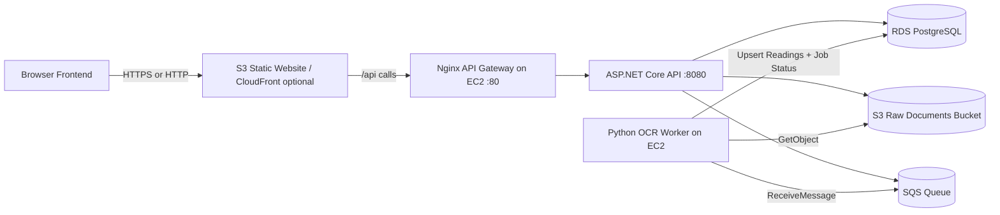
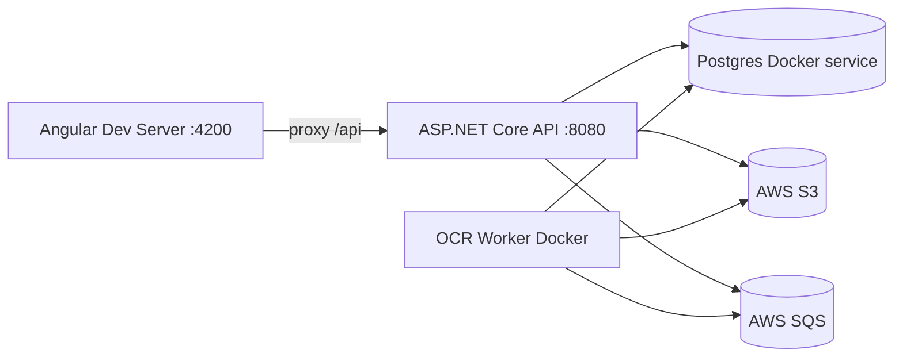

# AI Health Platform - Project Documentation

Last updated: 2026-03-06 (clinician UX overhaul, deployment improvements)

## 1) Documentation Map

Use the right document for the right purpose:

- `docs/PROJECT_DOCUMENTATION.md`: Product and system architecture, runtime behavior, API/domain model.
- `docs/AWS_FREE_TIER_DEPLOYMENT.md`: AWS provisioning, deployment commands, troubleshooting.
- `docs/PROBLEMS_AND_RESOLUTIONS.md`: Incident history and fixes in chronological order.

---

## 2) Project Overview

AI Health Platform is a multi-service health data processing platform that:

- Authenticates users and clinicians with JWT-based access.
- Accepts uploaded health documents (direct upload and presigned workflows).
- Stores raw files in S3 and queues processing in SQS.
- Runs asynchronous OCR/normalization in a Python worker.
- Persists readings, jobs, scores, and recommendations in PostgreSQL.
- Supports clinician review/approval workflow for recommendations.

---

## 3) Current Runtime Architecture

### 3.1 Production (AWS deployment)



### 3.2 Local development



---

## 4) Runtime Components

### 4.1 API Service (.NET 8)

Path: `src/Api`

Responsibilities:

- Authentication and JWT issuance.
- Upload orchestration (`presign`, `direct`, `finalize`, `reprocess`).
- Insights generation and retrieval (document and aggregate scope).
- Recommendation review workflow (request review, approve, pending queue).
- Persistence orchestration for documents, jobs, readings, and insights.

Key files:

- `src/Api/Program.cs`
- `src/Api/Controllers/AuthControllers.cs`
- `src/Api/Controllers/UploadControlller.cs`
- `src/Api/Controllers/InsightsController.cs`
- `src/Api/Controllers/HistoryController.cs`
- `src/Api/Controllers/BiomarkersController.cs`
- `src/Api/Controllers/MeController.cs`

### 4.2 OCR Worker (Python)

Path: `src/OcrWorker`

Responsibilities:

- Poll SQS with long-poll settings.
- Fetch source object from S3.
- OCR + parse + normalize biomarker readings.
- Apply mandatory biomarker policy.
- Update processing status and persist extracted readings.

Key files:

- `src/OcrWorker/main.py`
- `src/OcrWorker/app/worker.py`
- `src/OcrWorker/app/ocr_parser.py`
- `src/OcrWorker/app/normalization.py`
- `src/OcrWorker/app/config.py`
- `src/OcrWorker/app/data/biomarker.json`
- `src/OcrWorker/app/data/mandatory_biomarkers.json`

### 4.3 Data Store (PostgreSQL)

Core tables:

- `RawDocuments`
- `ProcessingJobs`
- `BiomarkerReadings`
- `ScoreSnapshots`
- `Recommendations`
- Identity tables (`AspNetUsers`, `AspNetRoles`, etc.)

---

## 5) Request and Processing Flows

### 5.1 Auth flow

1. `POST /api/auth/register`
2. `POST /api/auth/login`
3. Frontend stores JWT and sends Bearer token on protected calls.

### 5.2 Upload flow (recommended in browser)

1. `POST /api/uploads/direct` (multipart form upload to API).
2. API writes object to S3.
3. API creates `RawDocument` and `ProcessingJob` rows.
4. API sends SQS message.
5. Worker consumes queue message, parses document, writes readings.
6. Client polls `GET /api/uploads/status/{docId}`.

### 5.3 Upload flow (presigned alternative)

1. `POST /api/uploads/presign`
2. Browser `PUT` to S3 URL
3. `POST /api/uploads/finalize`
4. Same async worker flow as above.

### 5.4 Reprocess flow

- `POST /api/uploads/reprocess/{docId}`
- `POST /api/uploads/reprocess` with JSON body `{ "documentId": "..." }`

### 5.5 Insights flow

Document scope:

- `POST /api/insights/generate/{docId}`
- `GET /api/insights/{docId}`

Aggregate scope:

- `POST /api/insights/generate`
- `GET /api/insights/latest`

Recommendation review:

- `POST /api/insights/recommendations/{recommendationId}/request-review`
- `POST /api/insights/recommendations/{recommendationId}/approve` (optional `{ "content": "..." }` body to override text before publishing)
- `GET /api/insights/recommendations/pending?skip=0&take=50` (Clinician role)
- `GET /api/insights/recommendations/approved?skip=0&take=50` (Clinician role — approved history)

---

## 6) API Surface Summary

Auth:

- `POST /api/auth/register`
- `POST /api/auth/login`
- `GET /api/me`

Uploads:

- `POST /api/uploads/presign`
- `POST /api/uploads/direct`
- `POST /api/uploads/finalize`
- `GET /api/uploads/status/{docId}`
- `POST /api/uploads/reprocess/{docId}`
- `POST /api/uploads/reprocess`

History and biomarkers:

- `GET /api/history/documents`
- `GET /api/history/documents/{docId}/biomarkers`
- `GET /api/history/documents/{docId}/jobs`
- `GET /api/history/biomarkers`
- `GET /api/history/insights`
- `POST /api/biomarkers/manual`

Insights:

- `POST /api/insights/generate/{docId}`
- `GET /api/insights/{docId}`
- `POST /api/insights/generate`
- `GET /api/insights/latest`
- `POST /api/insights/recommendations/{recommendationId}/request-review`
- `POST /api/insights/recommendations/{recommendationId}/approve`
- `GET /api/insights/recommendations/pending`
- `GET /api/insights/recommendations/approved`

Operational:

- `GET /health`
- `GET /swagger/index.html`

---

## 7) Domain and Enum Reference

### 7.1 DocumentType

- `1 = LabPdf`
- `2 = GenomicsVcf`
- `3 = WearableJson`

### 7.2 JobType

- `1 = OcrLabPdf`
- `2 = ParseVcf`
- `3 = Normalize`
- `4 = ScoreRecalc`
- `5 = GenerateRecommendations`

### 7.3 JobStatus

- `1 = Ready`
- `2 = Processing`
- `3 = Succeeded`
- `4 = Failed`
- `5 = InsufficientData`

### 7.4 DocumentStatus

- `1 = Uploaded`
- `2 = Processing`
- `3 = Processed`
- `4 = Failed`

### 7.5 RecommendationType

- `1 = Insight`
- `2 = RiskPrediction`
- `3 = Action`

### 7.6 RecommendationStatus

- `1 = Draft`
- `2 = PendingReview`
- `3 = Published`
- `4 = Rejected`

---

## 8) Configuration and Security

### 8.1 Key environment variables

- DB: `ConnectionStrings__Default` or `CONNSTR_HOST` / `CONNSTR_RDS`
- JWT: `JWT_KEY`, `JWT_ISSUER`, `JWT_AUDIENCE`
- AWS: `AWS_REGION`, `S3_BUCKET`, `SQS_QUEUE_URL`
- CORS: `CORS_ALLOWED_ORIGINS`
- LLM: `LLM_BASE_URL`, `LLM_API_KEY`, `LLM_MODEL`, `LLM_TIMEOUT_SECONDS`
- Worker tuning: `OCR_POLL_WAIT_SECONDS`, `OCR_LOOP_SLEEP_SECONDS`

### 8.2 Runtime security notes

- CORS must be explicitly set for browser origins; malformed origins cause preflight failures.
- API applies EF migrations at startup; DB unreachability prevents app startup.
- Use EC2 IAM role for S3/SQS access, avoid long-lived AWS keys when possible.
- Keep EC2 SG `22` restricted to your IP.

---

## 9) Operational Notes (AWS)

- Nginx gateway listens on port `80` and proxies to API on `8080`.
- A `502 Bad Gateway` usually means upstream API failed to start.
- Most common root causes observed:
  - RDS SG/VPC connectivity issues.
  - Invalid or malformed `.env.aws` values (especially `CONNSTR_RDS`, `CORS_ALLOWED_ORIGINS`).
  - Running compose without `--env-file .env.aws`.

For complete deployment and troubleshooting commands, see:

- `docs/AWS_FREE_TIER_DEPLOYMENT.md`

---

## 10) Known Limitations and Next Improvements

- Parser remains rule-based and can still miss uncommon report layouts.
- Unit normalization coverage should continue expanding across biomarkers.
- Worker and API currently share one EC2 host in free-tier mode (resource contention risk).
- Add HTTPS-first edge architecture (CloudFront + ACM) for production-grade browser traffic.
- Add deeper observability (structured logs/metrics/alerts) and backup/restore runbooks.

---

## 11) Frontend Architecture

### 11.1 Role-based navigation

Navigation is driven by the authenticated user's role, resolved at runtime via `auth.me()` signal:

| Role | Pages visible |
|---|---|
| User | Dashboard, Uploads & Status, My History |
| Clinician | Clinician Review Queue, Review History |

Root path (`/`) uses a `homeGuard` that reads the user role and redirects:
- Clinician → `/clinician-review`
- User → `/dashboard`

### 11.2 Clinician Review Queue (`/clinician-review`)

- Displays all `PendingReview` recommendations as cards.
- Each card shows: title, type badge (Insight / Risk Prediction / Action), patient email, document ID, requested date, and recommendation content.
- **Edit**: toggles an inline textarea to modify recommendation text before approving.
- **Approve / Approve with Changes**: calls `POST /recommendations/{id}/approve` with optional updated content body.
- Approved items are removed from the queue immediately on success.

### 11.3 Review History (`/review-history`)

- Displays all `Published` + approved recommendations across all patients.
- Shows: title, type badge, patient email, document ID, approved date, and final recommendation content.
- Backed by `GET /api/insights/recommendations/approved`.

### 11.4 Angular Material setup

- Material Icons loaded via Google Fonts CDN in `index.html`:
  ```html
  <link href="https://fonts.googleapis.com/icon?family=Material+Icons" rel="stylesheet">
  ```
- Without this, `<mat-icon>` renders icon names as raw text.

## 11) Change Practice

- Add every meaningful incident and resolution to `docs/PROBLEMS_AND_RESOLUTIONS.md`.
- Keep architecture and deployment docs synchronized whenever runtime topology or commands change.
