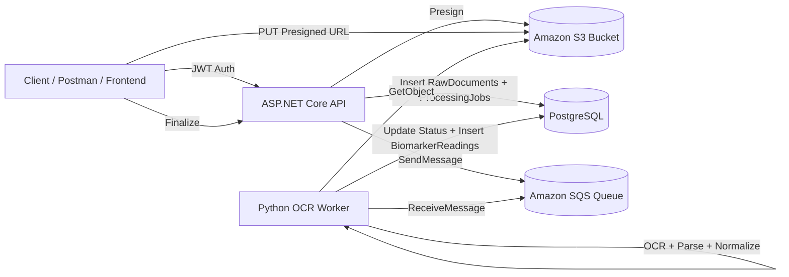

# AI Health Platform - Project Documentation

## 1) Project Overview

AI Health Platform is a two-service backend system that ingests health documents, stores source files in S3, queues processing through SQS, and extracts normalized biomarker readings into PostgreSQL.

Primary goals:
- Secure upload flow using pre-signed S3 URLs
- Asynchronous processing via queue/worker pattern
- Structured persistence for documents, jobs, and extracted biomarker data
- Idempotency on finalize to avoid duplicate records for same object key

---

## 2) High-Level Architecture



---

## 3) Runtime Components

### 3.1 API Service (ASP.NET Core, .NET 8)
Path: `src/Api`

Responsibilities:
- Authentication and JWT issuance
- Upload orchestration (`presign`, `finalize`, `reprocess`)
- Persisting document and job metadata
- Publishing queue messages for async processing

Key files:
- `src/Api/Program.cs`
- `src/Api/Controllers/AuthControllers.cs`
- `src/Api/Controllers/UploadControlller.cs`
- `src/Api/Auth/AppDbContext.cs`
- `src/Api/Domain/*.cs`

### 3.2 OCR Worker Service (Python)
Path: `src/OcrWorker`

Responsibilities:
- Poll SQS and process newest message
- Load source file from S3
- OCR + parse measurements
- Normalize units and canonical biomarker codes
- Persist readings and update job/document status

Key files:
- `src/OcrWorker/main.py`
- `src/OcrWorker/app/worker.py`
- `src/OcrWorker/app/ocr_parser.py`
- `src/OcrWorker/app/normalization.py`
- `src/OcrWorker/app/config.py`

### 3.3 Data Store
PostgreSQL with EF Core migrations.

Core tables:
- `RawDocuments`
- `ProcessingJobs`
- `BiomarkerReadings`
- Identity tables (`AspNetUsers`, `AspNetRoles`, etc.)

---

## 4) Project Structure

```text
AiHealthPlatform/
├── .env
├── Api.sln
├── docker-compose.yml
├── docs/
│   ├── PROJECT_DOCUMENTATION.md
│   └── PROBLEMS_AND_RESOLUTIONS.md
└── src/
    ├── Api/
    │   ├── Program.cs
    │   ├── Controllers/
    │   │   ├── AuthControllers.cs
    │   │   ├── MeController.cs
    │   │   └── UploadControlller.cs
    │   ├── Auth/
    │   ├── Domain/
    │   └── Migrations/
    └── OcrWorker/
        ├── Dockerfile
        ├── requirements.txt
        ├── README.md
        └── app/
            ├── config.py
            ├── normalization.py
            ├── ocr_parser.py
            └── worker.py
```

---

## 5) End-to-End Processing Flow

### Step 1: Authenticate
- `POST /api/auth/login`
- Returns JWT token for protected endpoints

### Step 2: Request Presigned URL
- `POST /api/uploads/presign`
- Body includes `fileName`, `contentType`, `docType`
- Returns `uploadUrl`, `bucket`, `objectKey`

### Step 3: Upload Document to S3
- `PUT <uploadUrl>`
- Must send matching `Content-Type`
- No Bearer token on this S3 PUT call

### Step 4: Finalize Upload
- `POST /api/uploads/finalize`
- Creates `RawDocument` + `ProcessingJob`
- Publishes message to SQS

### Step 5: Worker Processing
- Worker receives SQS message
- Downloads S3 object
- Extracts text from PDF/image (native PDF text first, OCR fallback)
- Parses measurements and normalizes units
- Inserts `BiomarkerReadings`
- Marks job/document as succeeded and deletes SQS message

### Step 6: Reprocess Existing Document (No Re-upload)
- `POST /api/uploads/reprocess/{docId}`
- Enqueues a fresh processing job for existing `RawDocument`

---

## 6) Domain Model Reference

### 6.1 DocumentType
- `1 = LabPdf`
- `2 = GenomicsVcf`
- `3 = WearableJson`

### 6.2 JobType
- `1 = OcrLabPdf`
- `2 = ParseVcf`
- `3 = Normalize`
- `4 = ScoreRecalc`
- `5 = GenerateRecommendations`

### 6.3 JobStatus
- `1 = Ready`
- `2 = Processing`
- `3 = Succeeded`
- `4 = Failed`

### 6.4 DocumentStatus
- `1 = Uploaded`
- `2 = Processing`
- `3 = Processed`
- `4 = Failed`

---

## 7) Environment Configuration

Main file: `.env`

Important values:
- DB: `POSTGRES_*`, `CONNSTR_HOST`, `CONNSTR_DOCKER`
- Auth: `JWT_KEY`, `JWT_ISSUER`, `JWT_AUDIENCE`
- AWS: `AWS_ACCESS_KEY_ID`, `AWS_SECRET_ACCESS_KEY`, `AWS_REGION`
- Storage/Queue: `S3_BUCKET`, `SQS_QUEUE_URL`

Notes:
- API/worker in Docker should use `CONNSTR_DOCKER` (`Host=db;Port=5432;...`)
- Local clients (pgAdmin) use mapped host port (for example `localhost:5433` if remapped)
- S3 and SQS region must match actual resource regions

---

## 8) Operational Runbook

### Start services
```bash
docker compose up -d --build
```

### Watch logs
```bash
docker compose logs -f api
docker compose logs -f ocr-worker
```

### Validate DB quickly
```sql
SELECT "Id","Status","ProcessedAtUtc" FROM "RawDocuments" ORDER BY "CreatedAtUtc" DESC LIMIT 5;
SELECT "Id","Status","AttemptCount","Error" FROM "ProcessingJobs" ORDER BY "CreatedAtUtc" DESC LIMIT 5;
SELECT "BiomarkerCode","Value","Unit","NormalizedValue","NormalizedUnit" FROM "BiomarkerReadings" ORDER BY "ObservedAtUtc" DESC LIMIT 20;
```

---

## 9) OCR Parser Behavior

Current extraction supports:
- Single-line measurement patterns
- Multi-line table patterns (`name -> value -> range -> unit`)

Normalization covers:
- Canonical biomarker naming (aliases)
- Unit canonicalization and conversions (selected biomarkers)
- Unicode/superscript unit cleanup (`µ`, `×`, `³`, `⁶`)

---

## 10) Known Limitations / Next Improvements

- Not all biomarker/unit combinations are normalized yet
- Parser currently rule-based (no ML document layout model yet)
- Readings dedupe is basic and can be expanded with stronger constraints
- API finalize error handling can be improved for cleaner downstream retry semantics

---

## 11) Change Log Practice

All incidents/fixes should be appended in:
- `docs/PROBLEMS_AND_RESOLUTIONS.md`

Expected update policy:
- Add one new entry per issue/fix
- Include symptom, root cause, resolution, and validation evidence
- Keep entries chronological (latest first)
